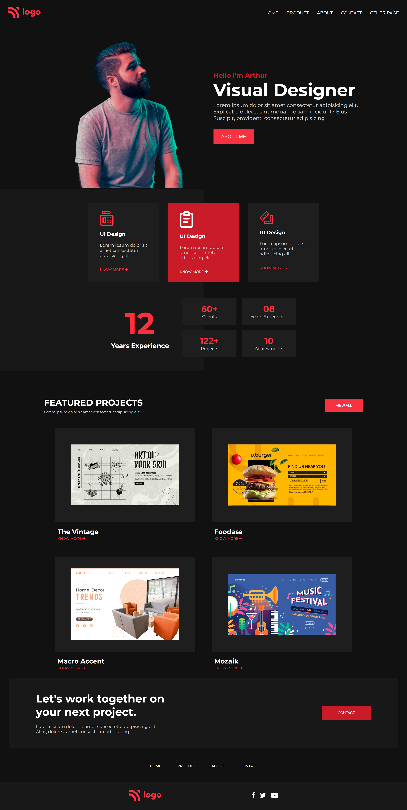

# HTML-CSS-PROJECT-15

# Project  [Live Link](https://html-css-project-15-blue.vercel.app/)

Project: Responsive Website with flexbox and media queries.

In this project, we uses flexbox and media queries to create a responsive website that adapts to different screen sizes and devices.

# Description

This project involves creating a responsive website using flexbox and media queries. The website is designed to adapt to different screen sizes and devices, providing an optimal user experience.

# Key Features:

flexbox properties for responsive design
Media queries for different screen sizes (tablet, desktop, mobile)
Adaptive layout for optimal user experience

Time Taken: 1 day

# Main Points

* Flexbox: used to create a flexible and responsive layout with properties such as `display: flex`, `flex-direction: column`, `align-items: center`, and `justify-content: center`
* Media Queries: used to apply different styles based on screen size (tablet, desktop, mobile)
* Responsive design: adapts to different screen sizes and devices for optimal user experience

# Screenshot

